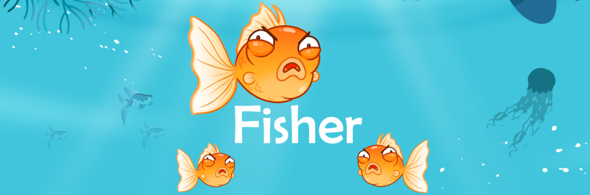
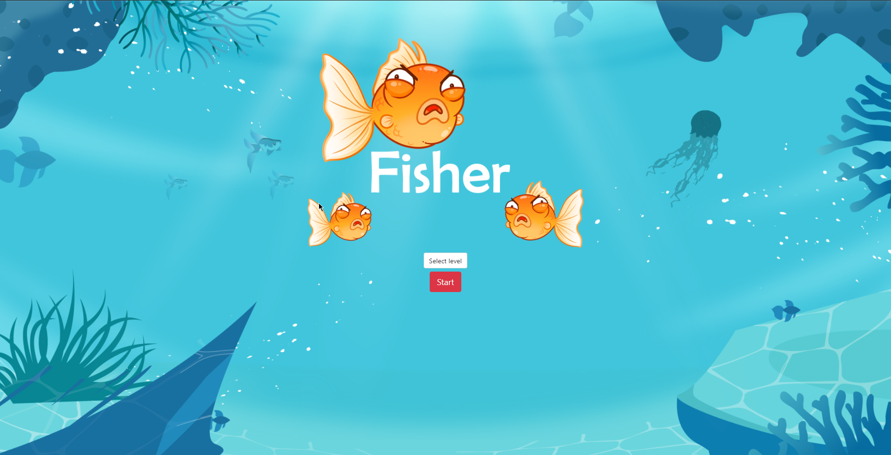

# 

# FISHER

🎣 Fisher  is a simple web game developed and programmed in HTML, CSS and JavaScript, intended for children from 5 years old to develop reflexes and visual skills. 🐠

 

## WHY DOES THIS PROJECT EXIST?
It's a web game developed during my HTML, CSS and JavaScript training.

 

## MEDIA

 

## CONTACT
 

 
 If you liked the project or have any constructive criticism related to the project or want to get in touch for some other reason or just want to help the developers and the project, here are some options:
	
- 🌎 Share this repository with your friends!
- ⭐ If you liked the idea, you can give it a fork and a star.
- 📬 Email the developments if you need something: peixinhoyago@gmail.com
 
 

</dvi>
